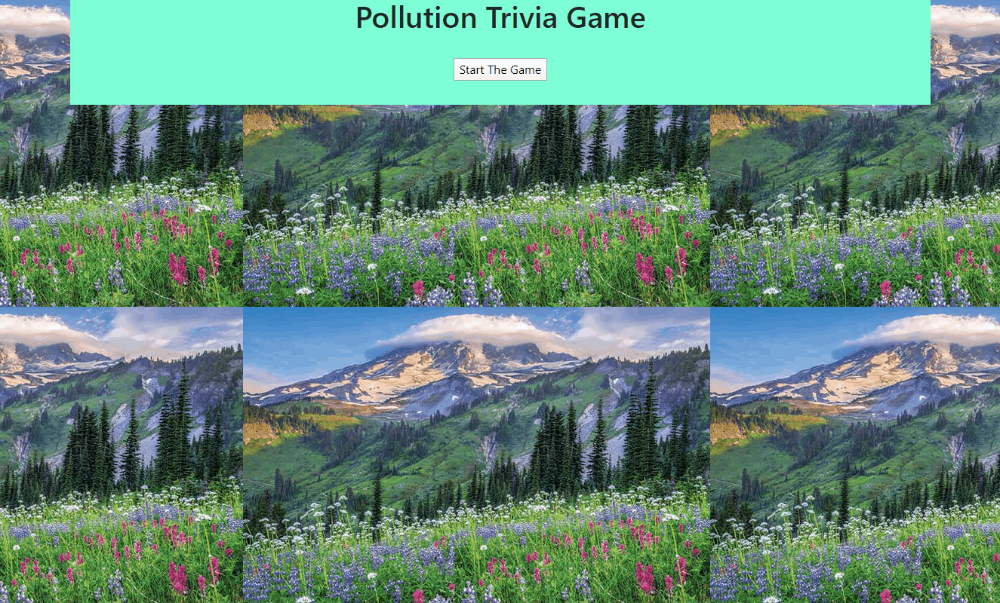

# TriviaGame

- I created a simple trivia game that includes a form with multiple choice options regarding our pollution crisis.

- The player will have a limited amount of time to finish the quiz (10 seconds).

- The game ends when the time runs out. The page will reveal the number of questions that players answer correctly and incorrectly.

- The player cannot pick more than one answer per question.

- This game does include a countdown timer.

### Demonstration

